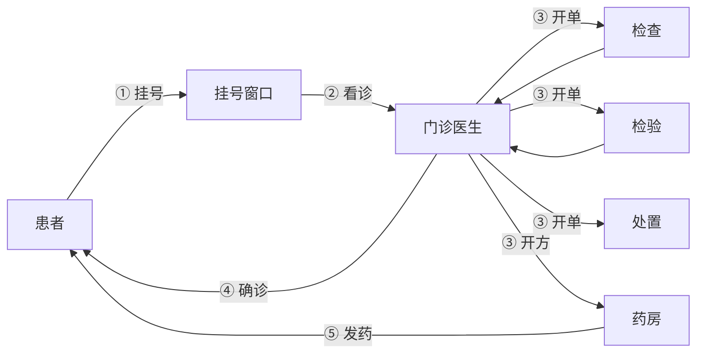
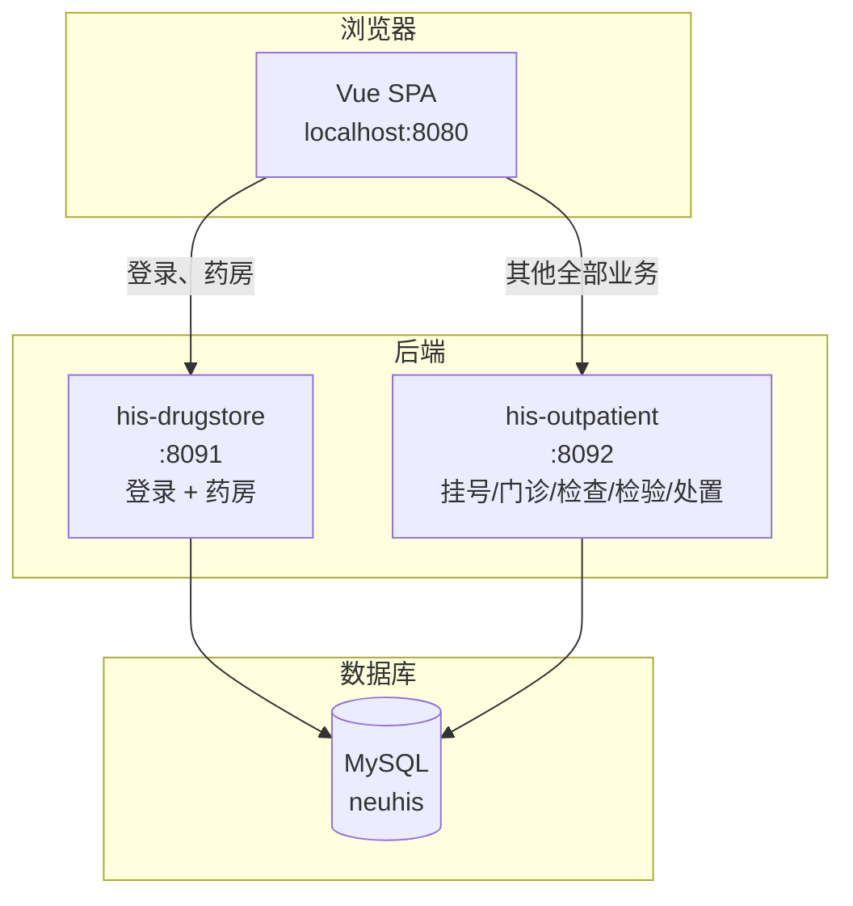
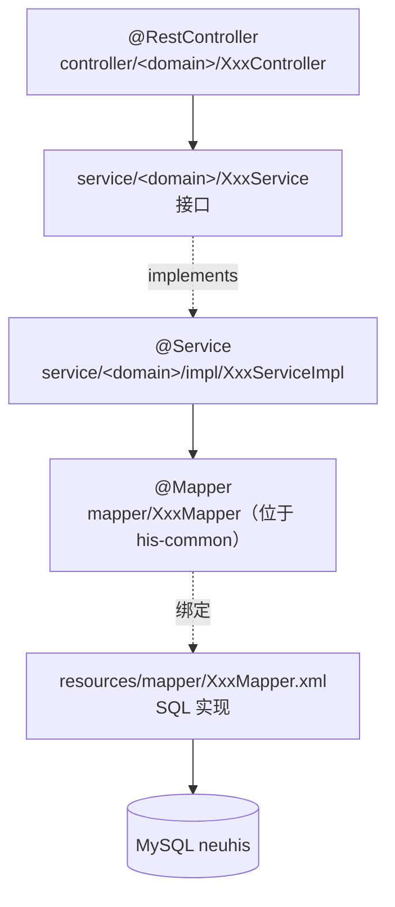
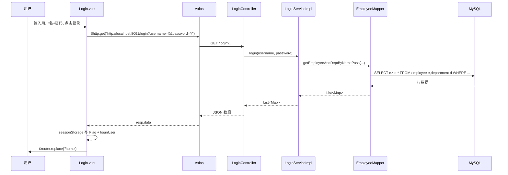
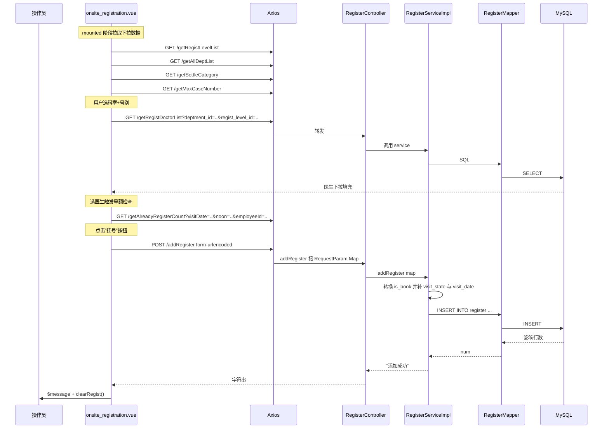
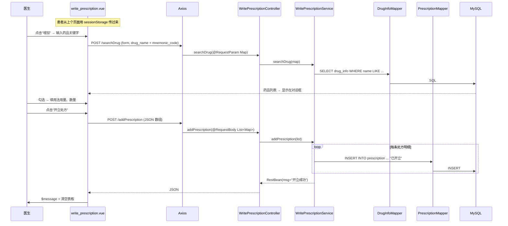
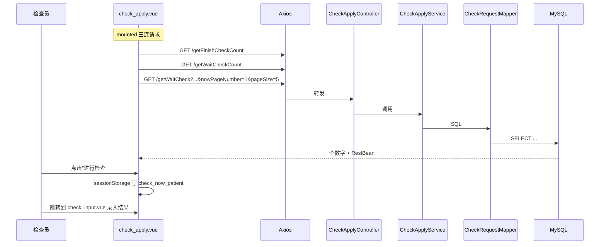
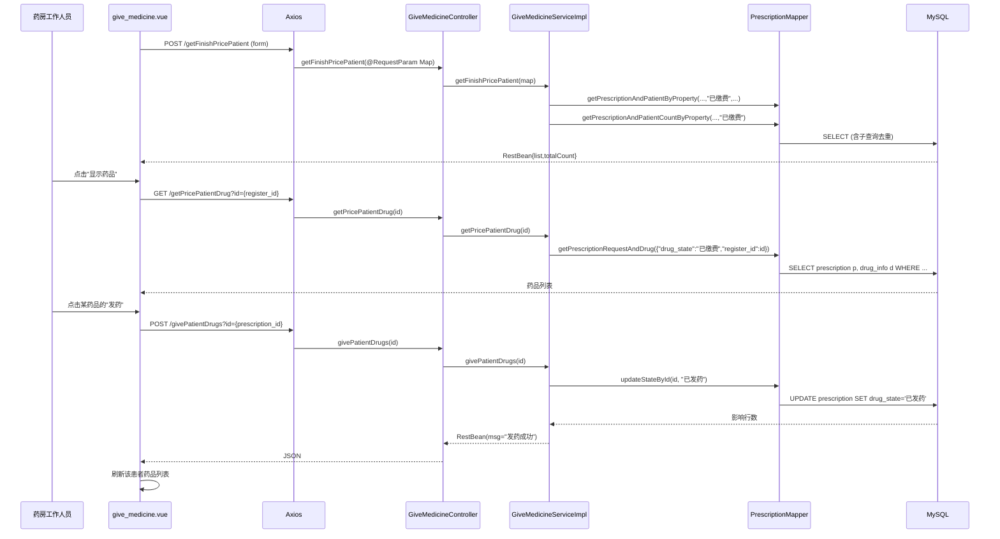
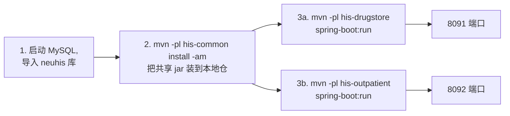

# HIS 医院信息系统 —— 项目教学文档

---

## 0. 项目总览

### 0.1 项目背景与业务场景

本项目模拟一个**医院信息系统（HIS, Hospital Information System）**，覆盖患者从入院到离院的核心业务流程：

- **挂号收费**：患者到医院窗口挂号，选医生，缴费
- **门诊医生**：医生查看患者、写病历、开检查/检验/处置申请单、开处方
- **检查管理**：影像类设备（B 超、CT 等）执行医生开出的检查申请
- **检验管理**：化验室对血、尿等标本进行检验
- **处置管理**：执行医生开出的物理治疗、注射等处置
- **药房管理**：根据缴费完成的处方发药、退药、管理药库



### 0.2 技术栈速览

| 层次 | 后端 (`backend/`) | 前端 (`front/`) |
|---|---|---|
| 语言 | Java 8 | JavaScript (ES2015+) |
| 框架 | Spring Boot 2.2.10 | Vue 2.6 |
| Web | Spring MVC | vue-router 3 |
| 数据库 | MySQL 5.7+（库名 `neuhis`） | — |
| ORM / 持久化 | MyBatis 2.0 | — |
| UI 组件 | — | Element UI 2.15 |
| HTTP | — | Axios 0.26 + qs |
| 构建 | Maven（多模块） | @vue/cli-service 4.x（webpack 4） |
| 状态管理 | — | Vuex 3（项目中未实际使用，会话存于 sessionStorage） |

### 0.3 整体架构图



**关键认知**：两个后端服务**必须同时启动**，前端才能完整工作。登录这一步走的是 8091，其他业务走 8092。

### 0.4 目录结构

```
codes/
├─ backend/                       # 后端 Maven 多模块工程
│  ├─ pom.xml                     # 聚合 POM
│  ├─ his-common/                 # 共享模块（Mapper + Bean + 工具）
│  │  └─ src/main/
│  │     ├─ java/com/neuedu/
│  │     │  ├─ bean/RestBean.java
│  │     │  ├─ util/PageUtil.java
│  │     │  └─ mapper/*Mapper.java
│  │     └─ resources/mapper/*.xml
│  ├─ his-drugstore/              # 药房 + 登录（端口 8091）
│  │  └─ src/main/java/com/neuedu/
│  │     ├─ DrugStoreApplication.java
│  │     ├─ controller/login/
│  │     ├─ controller/drugstore/
│  │     └─ service/...
│  └─ his-outpatient/             # 挂号/门诊/检查/检验/处置（端口 8092）
│     └─ src/main/java/com/neuedu/
│        ├─ OutPatientApplication.java
│        ├─ controller/{registration,physician,check,inspection,disposal}/
│        └─ service/...
└─ front/                         # 前端 Vue SPA
   ├─ package.json
   └─ src/
      ├─ main.js                  # 入口 + 全局配置 + 路由守卫
      ├─ App.vue
      ├─ router/index.js          # 路由表 + 菜单元数据
      ├─ layout/index.vue         # 主框架（顶栏 + 侧边菜单）
      ├─ views/Login.vue
      └─ views/{registration,physician,check,inspection,drugstore,disposal}/
```

### 0.5 启动方式（命令清单）

**后端**（PowerShell，建议两个终端窗口分别跑两个服务）：

```powershell
# 一次性把共享模块安装到本地 Maven 仓库
mvn -pl his-common install -am

# 终端 A：药房 + 登录（:8091）
mvn -pl his-drugstore spring-boot:run

# 终端 B：挂号 + 门诊 + 检查 + 检验 + 处置（:8092）
mvn -pl his-outpatient spring-boot:run
```

**前端**（第三个终端）：

```powershell
cd front
npm install --registry=https://registry.npmmirror.com
$env:NODE_OPTIONS="--openssl-legacy-provider"   # Node 17+ 必须
npm run serve                                    # 默认 :8080
```

浏览器访问 `http://localhost:8080`。

---

## 1. 公共约定与基础设施

### 1.1 后端响应封装：RestBean

`his-common/src/main/java/com/neuedu/bean/RestBean.java`

```java
public class RestBean {
    private List<Map<String,Object>> list;   // 对应查询数据
    private int totalCount;                  // 对应查询总条目数量
    private String msg;                      // 前端显示内容
    private String status;                   // 前端状态字符串：success/warning/info/error

    public RestBean() { super(); }
    public RestBean(List<Map<String,Object>> list, int totalCount, String msg, String status) {
        this.list = list;
        this.totalCount = totalCount;
        this.msg = msg;
        this.status = status;
    }
    // ... getter / setter / hashCode / equals / toString 略 ...
}
```

| 字段 | 类型 | 何时填写 |
|---|---|---|
| `list` | `List<Map<String,Object>>` | 列表查询返回的多行数据 |
| `totalCount` | `int` | 分页时返回总条数，让前端 `el-pagination` 渲染页码 |
| `msg` | `String` | 提示文字，前端 `this.$message(...)` 直接显示 |
| `status` | `String` | 业务状态：`success` / `warning` / `info` / `error` |

> 注意：**并非所有接口都返回 `RestBean`**。例如登录直接返回 `List<Map>`，`addRegister` 返回原始字符串 `"添加成功"`。本项目没有做全局响应包装。

### 1.2 后端分页约定：PageUtil + LIMIT

`his-common/src/main/java/com/neuedu/util/PageUtil.java`

```java
public class PageUtil {
    /**
     * 将分页提交map请求中，将nowPageNumber和pageSize转换为Integer
     */
    public static Map<String,Object> objectToInt(Map<String,Object> map) {
        map.put("nowPageNumber", new Integer(map.get("nowPageNumber").toString()));
        map.put("pageSize",      new Integer(map.get("pageSize").toString()));
        return map;
    }
}
```

MyBatis XML 中的分页 SQL 模式：

```xml
SELECT *
FROM register
WHERE visit_state = #{visit_state}
ORDER BY visit_date DESC
LIMIT ${(nowPageNumber-1) * pageSize} ,#{pageSize}
```

**关键教学点**：

- `#{}` 是**预编译占位符**（参数化查询，防 SQL 注入）
- `${}` 是**字符串拼接**（不防注入，会直接把值替换到 SQL 文本里）
- 这里偏移量 `(nowPageNumber-1) * pageSize` 用 `${}`，是因为 LIMIT 的 offset 不能用占位符；但代价是：如果 `nowPageNumber` 来自不可信源，会有注入风险。本项目数据来自前端分页组件，相对可控，但生产项目应使用 PageHelper 等插件。

### 1.3 后端包结构与分层



约定要点：
- 控制器只做"接参、转调、返回"，不写业务逻辑
- Service 接口与实现分开，Spring 注入用接口
- **所有 Mapper（含 XML）都放在 `his-common`**——这是项目最容易踩的坑：放到 `his-drugstore` 或 `his-outpatient` 自己的 `resources/mapper/` 里不会被加载，因为 `application.properties` 配的是 `classpath:/mapper/*.xml`，靠 common 这个 jar 进入 classpath。

### 1.4 前端全局配置：main.js

`front/src/main.js`

```js
import Vue from 'vue'
import App from './App.vue'
import router from './router'
import store from './store'
import ElementUI from 'element-ui';
import Axios from 'axios'
import 'element-ui/lib/theme-chalk/index.css';

Vue.config.productionTip = false

Vue.use(ElementUI);
// ✨ 关键：让所有 POST 请求默认以表单方式提交（配合 qs.stringify 使用）
Axios.defaults.headers.post['Content-Type'] = 'application/x-www-form-urlencoded';
Vue.prototype.$http = Axios;     // 全局注入 this.$http

new Vue({
  router,
  store,
  render: h => h(App)
}).$mount('#app')
```

> 因此每个组件里都能写 `this.$http.post(url, qs.stringify(payload))`，后端 Controller 用 `@RequestParam Map<String,Object>` 接收。

### 1.5 前端路由与菜单授权

`front/src/router/index.js` 集中管理所有路由。结构：

```js
const routes = [
  { path: '/',         component: Login,  meta: { isLogin: false } },
  { path: '/home',     component: Layout, meta: { isLogin: true  } },
  {
    path: '/', name: '挂号收费', component: Layout,
    iconCls: 'el-icon-document',
    meta: { type: '财务' },     // ← 业务分组类型
    children: [
      { path: '/onsite-registration', name: '窗口挂号',
        component: () => import('../views/registration/onsite_registration.vue'),
        meta: { isLogin: true } },
      // ... 其他子路由 ...
    ]
  },
  { path: '/', name: '门诊医生', component: Layout, meta: { type: '门诊' }, children: [ ... ] },
  { path: '/', name: '检查管理', component: Layout, meta: { type: '检查' }, children: [ ... ] },
  { path: '/', name: '检验管理', component: Layout, meta: { type: '检验' }, children: [ ... ] },
  { path: '/', name: '药房管理', component: Layout, meta: { type: '药房' }, children: [ ... ] },
  { path: '/', name: '处置管理', component: Layout, meta: { type: '处置' }, children: [ ... ] },
]
```

**菜单级权限**全部在 `front/src/layout/index.vue` 里实现：

```html
<el-submenu :index="''+index"
  v-for="(item,index) in this.menuList" :key="index"
  v-if="!item.hidden && (item.meta.type == dept_type || dept_type == 'root')">
  <template slot="title">
    <i :class="item.iconCls"></i><span>{{item.name}}</span>
  </template>
  <el-menu-item :index="child.path"
    v-for="(child,cindex) in item['children']" :key="cindex">
    <span>{{child.name}}</span>
  </el-menu-item>
</el-submenu>
```

```js
mounted: function(){
  this.menuList = this.$router.options.routes;
  let loginUser = sessionStorage.getItem("loginUser");
  if(loginUser != null && loginUser.length > 0){
    loginUser = JSON.parse(loginUser);
    this.titleUserName = loginUser.realname;
    this.dept_type = loginUser.dept_type;   // ← 来自登录返回的部门类型
  }
}
```

**教学反思**：这是整个项目**唯一的"权限控制"**。也就是说：
- 后端**没有任何鉴权**，任何人知道 URL（如 `http://localhost:8091/givePatientDrugs?id=1`）都能调用
- 前端只是按 `dept_type` 隐藏菜单
- `root` 用户能看到所有菜单（登录页提示不要拿 root 做业务操作）

### 1.6 前端会话与路由守卫

`main.js` 末尾：

```js
router.beforeEach((to, from, next) => {
  let getFlag = sessionStorage.getItem("Flag");
  if(getFlag === "isLogin"){
    store.state.isLogin = true
    next()
    if (!to.meta.isLogin) {
      next({ path: '/home' })     // 已登录不允许回登录页
    }
  }else{
    if(to.meta.isLogin){
      next({ path: '/' })          // 未登录访问受保护页面 → 回登录
    }else{
      next()
    }
  }
});
```

会话存储两把钥匙：

| sessionStorage 键 | 值 | 用途 |
|---|---|---|
| `Flag` | 字符串 `"isLogin"` | 是否已登录的标志 |
| `loginUser` | JSON 字符串（员工行） | 当前用户信息（含 `realname`、`dept_type`、`id` 等） |

### 1.7 跨域：@CrossOrigin

每个 Controller 类上都加：

```java
@RestController
@CrossOrigin
public class LoginController { ... }
```

> 这种"每个类都加一遍"的写法在生产项目里通常会换成全局 `WebMvcConfigurer.addCorsMappings()`，本项目保留分散写法作为教学。

---

## 2. 登录功能（drugstore 模块）

### 2.1 功能描述

用户在登录页输入用户名 + 密码 → 后端按姓名 + 密码联合查询 `employee` + `department` 两张表 → 返回员工信息（含部门类型 `dept_type`） → 前端写入 `sessionStorage` 后跳转 `/home`。

### 2.2 文件清单

```
backend/
├─ his-drugstore/src/main/java/com/neuedu/
│  ├─ controller/login/LoginController.java
│  └─ service/login/
│     ├─ LoginService.java
│     └─ impl/LoginServiceImpl.java
└─ his-common/src/main/
   ├─ java/com/neuedu/mapper/EmployeeMapper.java
   └─ resources/mapper/EmployeeMapper.xml
front/
└─ src/views/Login.vue
```

### 2.3 后端实现

**Controller**（`LoginController.java`）：

```java
package com.neuedu.controller.login;
import java.util.List;
import java.util.Map;

import org.springframework.beans.factory.annotation.Autowired;
import org.springframework.web.bind.annotation.CrossOrigin;
import org.springframework.web.bind.annotation.RequestMapping;
import org.springframework.web.bind.annotation.RestController;

import com.neuedu.service.login.LoginService;

/**
 * 权限管理：登录管理
 */
@RestController
@CrossOrigin
public class LoginController {
    @Autowired
    private LoginService loginService;

    @RequestMapping("login")
    public List<Map<String,Object>> login(String username, String password){
        return loginService.login(username, password);
    }
}
```

逐行解读：
- `@RestController` = `@Controller` + `@ResponseBody`，方法返回值会被 Jackson 序列化为 JSON
- `@CrossOrigin` 放过浏览器对 `localhost:8080 → localhost:8091` 的跨域请求
- `@Autowired` 字段注入；接口注入实现由 Spring 决定
- `@RequestMapping("login")`：不限定 HTTP 方法，GET / POST 都接受
- 两个参数 `username` / `password` 不加 `@RequestParam`，Spring 默认按同名查询参数取值

**Service 接口**（`LoginService.java`）：

```java
package com.neuedu.service.login;
import java.util.List;
import java.util.Map;

public interface LoginService {
    List<Map<String, Object>> login(String username, String password);
}
```

**Service 实现**（`LoginServiceImpl.java`）：

```java
package com.neuedu.service.login.impl;
import java.util.List;
import java.util.Map;

import org.springframework.beans.factory.annotation.Autowired;
import org.springframework.stereotype.Service;

import com.neuedu.mapper.EmployeeMapper;
import com.neuedu.service.login.LoginService;

@Service
public class LoginServiceImpl implements LoginService {
    @Autowired
    private EmployeeMapper employeeMapper;

    @Override
    public List<Map<String, Object>> login(String username, String password) {
        return employeeMapper.getEmployeeAndDeptByNamePass(username, password);
    }
}
```

**Mapper 接口**（`his-common`，`EmployeeMapper.java`）：

```java
@Mapper
public interface EmployeeMapper {
    List<Map<String, Object>> getRegistDoctorList(String deptmentId, String registLevelId);
    List<Map<String, Object>> getEmployeeByDeptid(String deptment_id);
    List<Map<String, Object>> getEmployeeAndDeptByNamePass(String realname, String password);
}
```

**Mapper XML**（`EmployeeMapper.xml`）：

```xml
<select id="getEmployeeAndDeptByNamePass" resultType="java.util.Map">
  SELECT e.id id, e.realname realname,
         d.id deptment_id, d.dept_name dept_name, d.dept_type dept_type
  FROM employee e, department d
  WHERE e.deptment_id = d.id
    AND realname = #{realname, jdbcType=VARCHAR}
    AND password = #{password, jdbcType=VARCHAR}
</select>
```

**SQL 教学点**：
- 用了**隐式连接**（`FROM A, B WHERE A.x = B.y`）；现代写法推荐 `INNER JOIN ... ON`
- 别名后置（`d.id deptment_id`）让前端拿到 `deptment_id` 这个 key，方便复用
- 密码**明文存储**！仅作教学；真实项目应当存哈希（BCrypt 等）

### 2.4 前端实现

`front/src/views/Login.vue`（仅展示核心方法）：

```html
<el-form class="login-container" label-position="left" label-width="0px" v-loading="loading">
  <h3 class="login_title">系统登录</h3>
  <el-form-item prop="account">
    <el-input type="text" v-model="loginForm.username" placeholder="账号"></el-input>
  </el-form-item>
  <el-form-item prop="checkPass">
    <el-input type="password" v-model="loginForm.password" placeholder="密码"
              @keyup.enter.native="submitClick"></el-input>
  </el-form-item>
  <el-checkbox class="login_remember" v-model="checked">记住密码</el-checkbox>
  <el-form-item style="width: 100%">
    <el-button type="primary" @click.native.prevent="submitClick" style="width: 100%">登录</el-button>
  </el-form-item>
</el-form>
```

```js
export default {
  mounted: function () { this.rememberPassword(); },
  data(){
    return {
      checked: false,
      loginForm: { username: '', password: '' },
      loading: false
    }
  },
  methods: {
    rememberPassword(){
      let userInfo = localStorage.getItem("remember_password");
      if(userInfo != null && userInfo.length > 0){
        userInfo = JSON.parse(userInfo);
        this.loginForm.username = userInfo.username;
        this.loginForm.password = userInfo.password;
      }
    },
    submitClick: function () {
      if (!this.loginForm.username || !this.loginForm.password) {
        this.$message({ type: 'info', message: '用户名和密码不能为空!' });
        return;
      }
      let url = "http://localhost:8091/login?username=" + this.loginForm.username
              + "&password=" + this.loginForm.password;
      this.$http.get(url).then(resp => {
        let userInfo = resp.data;
        if (userInfo == null || userInfo.length == 0){
          this.$message({ message: '用户名或密码 不存在或错误!', type: 'error' });
        } else {
          // 写入两把会话钥匙
          sessionStorage.setItem("Flag", "isLogin");
          sessionStorage.setItem("loginUser", JSON.stringify(userInfo[0]));
          this.$message('欢迎 ' + userInfo[0].realname + ' 登录成功!');
          if(this.checked) {
            localStorage.setItem("remember_password", JSON.stringify(this.loginForm));
          } else {
            localStorage.removeItem("remember_password");
          }
          this.$router.replace({ path: '/home' });
        }
      });
    },
  }
}
```

**教学坑点**：
- 用户名、密码直接拼接到 URL（GET 参数）—— 明文穿越，**这是教学项目妥协**，生产中应该用 POST + HTTPS
- 记住密码用 `localStorage`（持久化），登录态用 `sessionStorage`（关浏览器即丢）

### 2.5 登录调用链时序图



### 2.6 知识点小结

| 技术点 | 出现位置 |
|---|---|
| `@RestController` / `@CrossOrigin` | `LoginController` |
| Spring 字段注入 `@Autowired` | `LoginController`、`LoginServiceImpl` |
| `@RequestMapping` 不限方法 | `LoginController.login()` |
| MyBatis `@Mapper` 接口 + XML 实现 | `EmployeeMapper` |
| MyBatis 联表查询、列别名 | `getEmployeeAndDeptByNamePass` |
| Vue `v-model` 双向绑定 | `Login.vue` 输入框 |
| Axios `this.$http.get()` | `Login.vue` `submitClick` |
| `sessionStorage` / `localStorage` | `Login.vue` |
| Vue Router `replace` | `Login.vue` 跳转 |

---

## 3. 挂号收费（outpatient 模块）

### 3.1 功能描述

5 个子页面：
1. **窗口挂号** —— 接待新患者，选科室/医生/号别，缴费
2. **窗口退号** —— 撤销当日尚未看诊的挂号
3. **收费** / **退费** —— 处理医生开出的费用项目
4. **费用记录查询** —— 历史费用流水

本章以"窗口挂号 + 窗口退号"两个最具代表性的页面为例。

### 3.2 文件清单

```
backend/his-outpatient/src/main/java/com/neuedu/
├─ controller/registration/
│  ├─ RegisterController.java            ← 本章主角
│  ├─ RegistLevelController.java         （号别字典）
│  ├─ DepartmentController.java          （科室字典）
│  ├─ EmployeeController.java            （医生字典）
│  ├─ SettleCategoryController.java      （结算类别字典）
│  └─ ExpenseChargeController.java       （收费/退费）
└─ service/registration/...
backend/his-common/src/main/
├─ java/com/neuedu/mapper/RegisterMapper.java
└─ resources/mapper/RegisterMapper.xml
front/src/views/registration/
├─ onsite_registration.vue               ← 本章主角（挂号表单）
├─ registration_record.vue               ← 本章主角（退号列表）
├─ expense_charge.vue
├─ expense_refund.vue
└─ expense_manage.vue
```

### 3.3 后端实现

#### Controller：RegisterController.java（全代码）

```java
package com.neuedu.controller.registration;

import java.util.Map;
import org.springframework.beans.factory.annotation.Autowired;
import org.springframework.web.bind.annotation.CrossOrigin;
import org.springframework.web.bind.annotation.RequestMapping;
import org.springframework.web.bind.annotation.RequestParam;
import org.springframework.web.bind.annotation.RestController;

import com.neuedu.bean.RestBean;
import com.neuedu.service.registration.RegisterService;

@RestController
@CrossOrigin
public class RegisterController {
    @Autowired
    private RegisterService registerService;

    // 挂号
    @RequestMapping("addRegister")
    public String addRegister(@RequestParam Map<String,Object> map) {
        return registerService.addRegister(map);
    }

    // 得到最大病例号
    @RequestMapping("getMaxCaseNumber")
    public String getMaxCaseNumber(){
        return registerService.getMaxCaseNumber();
    }

    // 已挂号数量统计（用于前端判断医生号额是否已满）
    @RequestMapping("getAlreadyRegisterCount")
    public String getAlreadyRegisterCount(String visitDate, String noon, String employeeId) {
        return registerService.getAlreadyRegisterCount(visitDate, noon, employeeId);
    }

    // 得到退号患者信息（状态=1 的患者，分页）
    @RequestMapping("getRecordRefundPatient")
    public RestBean getRecordRefundPatient(String case_number, String real_name,
                                           Integer nowPageNumber, Integer pageSize) {
        return registerService.getRecordRefundPatient(case_number, real_name, nowPageNumber, pageSize);
    }

    // 接诊（医生端：将状态从 1 改为 2）
    @RequestMapping("treatPatient")
    public RestBean treatPatient(Integer id) {
        return registerService.treatPatient(id);
    }

    // 退号（将状态改为 4）
    @RequestMapping("refundMedicalRecord")
    public RestBean refundMedicalRecord(Integer id) {
        return registerService.refundMedicalRecord(id);
    }
}
```

`visit_state` 是挂号记录的核心状态字段：

| 状态码 | 含义 |
|---|---|
| 1 | 已挂号、等待看诊 |
| 2 | 已接诊（医生开始看） |
| 3 | 已完成（医生结束看诊） |
| 4 | 已退号 |

#### Service：RegisterServiceImpl.java（全代码）

```java
@Service
public class RegisterServiceImpl implements RegisterService {
    @Autowired
    private RegisterMapper registerMapper;

    // 添加挂号信息
    @Override
    public String addRegister(Map<String, Object> map) {
        // 前端 el-switch 传过来的是 'true'/'false' 字符串，转成中文
        String isBook = (String) map.get("is_book");
        if("true".equals(isBook))       map.put("is_book", "是");
        else if("false".equals(isBook)) map.put("is_book", "否");

        map.put("visit_state", "1");          // 新挂号默认状态 1
        map.put("visit_date", new Date());    // 服务端时间，防止前端篡改

        int num = registerMapper.addRegister(map);
        return num > 0 ? "添加成功" : "添加失败";
    }

    @Override
    public String getAlreadyRegisterCount(String visitDate, String noon, String employeeId) {
        return registerMapper.getAlreadyRegisterCount(visitDate, noon, employeeId);
    }

    // 得到最大病例号（新挂号时自动 +1）
    @Override
    public String getMaxCaseNumber() {
        return registerMapper.getMaxCaseNumber();
    }

    // 退号患者列表（状态 = 1）
    @Override
    public RestBean getRecordRefundPatient(String case_number, String real_name,
                                           Integer nowPageNumber, Integer pageSize) {
        RestBean rest = new RestBean();
        rest.setList(registerMapper.getPagePatientByState(case_number, real_name, nowPageNumber, pageSize, 1));
        rest.setTotalCount(registerMapper.getPagePatientByStateCount(case_number, real_name, 1));
        return rest;
    }

    // 退号
    @Override
    public RestBean refundMedicalRecord(Integer id) {
        registerMapper.updateStateById(id, 4);
        RestBean rest = new RestBean();
        rest.setMsg("退号成功");
        return rest;
    }

    // 接诊
    @Override
    public RestBean treatPatient(Integer id) {
        registerMapper.updateStateById(id, 2);
        RestBean rest = new RestBean();
        rest.setMsg("接诊成功");
        return rest;
    }
}
```

#### Mapper XML：RegisterMapper.xml（节选 addRegister 与分页查询）

```xml
<!-- 添加挂号 -->
<insert id="addRegister" parameterType="java.util.Map">
  INSERT INTO register
  <trim prefix='(' suffix=')' suffixOverrides=','>
    <if test="case_number != null and case_number != ''">case_number,</if>
    <if test="real_name != null and real_name != ''">real_name,</if>
    <if test="gender != null and gender != ''">gender,</if>
    <if test="card_number != null and card_number != ''">card_number,</if>
    <if test="birthday != null and birthday != ''">birthday,</if>
    <if test="age != null and age != ''">age,</if>
    <if test="age_type != null and age_type != ''">age_type,</if>
    <if test="home_address != null and home_address != ''">home_address,</if>
    <if test="visit_date != null">visit_date,</if>
    <if test="noon != null and noon != ''">noon,</if>
    <if test="deptment_id != null and deptment_id != ''">deptment_id,</if>
    <if test="employee_id != null and employee_id != ''">employee_id,</if>
    <if test="regist_level_id != null and regist_level_id != ''">regist_level_id,</if>
    <if test="settle_category_id != null and settle_category_id != ''">settle_category_id,</if>
    <if test="is_book != null and is_book != ''">is_book,</if>
    <if test="regist_method != null and regist_method != ''">regist_method,</if>
    <if test="regist_money != null and regist_money != ''">regist_money,</if>
    <if test="visit_state != null and visit_state != ''">visit_state,</if>
  </trim>
  <trim prefix="VALUES (" suffix=")" suffixOverrides=",">
    <if test="case_number != null and case_number != ''">#{case_number,jdbcType=VARCHAR},</if>
    <if test="real_name != null and real_name != ''">#{real_name,jdbcType=VARCHAR},</if>
    <!-- ... 同上其他字段 ... -->
    <if test="visit_state != null and visit_state != ''">#{visit_state,jdbcType=INTEGER},</if>
  </trim>
</insert>

<!-- 退号列表（按状态过滤分页） -->
<select id="getPagePatientByState" resultType="java.util.Map">
  SELECT *
  FROM register
  WHERE visit_state = #{visit_state}
    <if test="(case_number==null or case_number=='') and (real_name==null or real_name=='')">
      AND date(visit_date) = date(now())
    </if>
    <if test="case_number != null and case_number != ''">
      AND case_number = #{case_number}
    </if>
    <if test="real_name != null and real_name != ''">
      AND real_name = #{real_name}
    </if>
  ORDER BY visit_date DESC
  LIMIT ${(nowPageNumber-1) * pageSize} ,#{pageSize}
</select>

<!-- 改状态 -->
<update id="updateStateById">
  UPDATE register
  SET visit_state = #{visit_state, jdbcType=INTEGER}
  WHERE id = #{id, jdbcType=INTEGER}
</update>
```

`<trim>` + `<if>` 是 MyBatis 的"**动态 SQL 构造**"：哪些字段非空就拼哪些，避免大量 `null` 入库。

### 3.4 前端实现

#### 挂号表单：onsite_registration.vue（关键片段）

模板层用 `el-descriptions` 把表单分成"基本信息"和"挂号信息"两块：

```html
<el-descriptions title="基本信息" :column="3" border>
  <el-descriptions-item label="病历号">
    <el-input v-model="register.case_number"></el-input>
  </el-descriptions-item>
  <el-descriptions-item label="姓名">
    <el-input v-model="register.real_name"></el-input>
  </el-descriptions-item>
  <el-descriptions-item label="性别">
    <el-select v-model="register.gender">
      <el-option v-for="item in register_gender"
                 :key="item.value" :label="item.label" :value="item.value"/>
    </el-select>
  </el-descriptions-item>
  <!-- 出生日期、年龄、身份证、家庭住址 ... -->
</el-descriptions>

<el-descriptions title="挂号信息" :column="3" border>
  <el-descriptions-item label="挂号科室">
    <el-select v-model="register.deptment_id">
      <el-option v-for="item in register_dept"
                 :key="item.id" :label="item.dept_name" :value="item.id"/>
    </el-select>
  </el-descriptions-item>
  <el-descriptions-item label="号别">
    <!-- ✨ 选号别会触发联动 -->
    <el-select v-model="register.regist_level_id" @change="registerLevelChange">
      <el-option v-for="item in register_level"
                 :key="item.id" :label="item.regist_name" :value="item.id"/>
    </el-select>
  </el-descriptions-item>
  <el-descriptions-item label="看诊医生">
    <el-select v-model="register.employee_id" @change="getAlreadyRegisterCount">
      <el-option v-for="item in register_employee"
                 :key="item.id" :label="item.realname" :value="item.id"/>
    </el-select>
  </el-descriptions-item>
  <el-descriptions-item label="病历本">
    <el-switch v-model="register.is_book" @change="registerIsbookChange"/>
  </el-descriptions-item>
  <!-- ... 应收金额、收费方式 ... -->
</el-descriptions>
```

`script` 部分（精简版）：

```js
import qs from 'qs'

export default {
  methods:{
    // 提交挂号
    addNewRegist(){
      this.$http.post(
        "http://localhost:8092/addRegister",
        qs.stringify(this.register)     // ✨ 表单格式提交
      ).then((resp)=>{
        this.$message({ message: resp.data, type: 'success' });
        this.clearRegist();
      })
    },

    // 选号别 → 改价 + 拉取该科室+号别的医生列表
    registerLevelChange(noonValue){
      this.register.is_book = false;
      for(let item of this.register_level){
        if(noonValue == item.sequence_no){
          this.register.regist_money = item.regist_fee;
          this.register.total_number = item.regist_quota;
        }
      }
      this.register.employee_id = '';
      this.$http.get("http://localhost:8092/getRegistDoctorList?"
        + "deptment_id="     + this.register.deptment_id
        + "&regist_level_id=" + this.register.regist_level_id
      ).then((resp)=>{ this.register_employee = resp.data; })
    },

    // 选医生 → 检查号额
    getAlreadyRegisterCount(){
      this.$http.get("http://localhost:8092/getAlreadyRegisterCount?"
        + "visitDate=" + this.register.visit_date
        + "&noon="     + this.register.noon
        + "&employeeId=" + this.register.employee_id
      ).then((resp)=>{
        this.register.used_number = resp.data;
        if(this.register.used_number == this.register.total_number){
          this.$message({ message: '警告，该医生号额已满，请选择其他医生', type: 'warning' });
        }
      })
    },

    // 切换病历本 → 加/减 1 元
    registerIsbookChange(){
      this.register.regist_money += this.register.is_book ? 1 : -1;
    },
  },
  mounted(){
    this.initDateTime();
    this.getRegistLevelList();    // GET /getRegistLevelList
    this.getDeptList();           // GET /getAllDeptList
    this.getSettleCategory();     // GET /getSettleCategory
    this.getMaxCaseNumber();      // GET /getMaxCaseNumber
  },
  data(){
    return {
      register: {
        id:'', case_number:'', real_name:'', gender:'男',
        card_number:'', birthday:'', age:'', age_type:'年',
        home_address:'', visit_date:'', noon:'上午',
        deptment_id:'', employee_id:'', regist_level_id:'',
        settle_category_id:'1', used_number:'0', is_book:false,
        regist_method:'医保卡', regist_money:'', visit_state:''
      },
      register_level:[], register_employee:[], register_dept:[], register_settle:[],
      // 下拉选项常量略
    }
  }
}
```

#### 退号列表：registration_record.vue（全代码示范"列表+分页"模式）

```html
<template>
  <div>
    <el-divider/>
    <div style="font-size:20px;text-align:left">
      <i class="el-icon-document-checked">窗口退号</i>
    </div>
    <el-divider/>
    <el-row :gutter="20">
      <el-col :span="6"><el-input v-model="case_number" placeholder="请输入患者病历号"/></el-col>
      <el-col :span="6"><el-input v-model="real_name"   placeholder="请输入患者姓名"/></el-col>
      <el-col :span="2"><el-button @click="getWaitPatient(1)">搜索</el-button></el-col>
    </el-row>
    <el-divider/>
    <el-table :data="wait_patient" style="width:80%">
      <el-table-column type="index"           label="编号"      width="80"/>
      <el-table-column prop="case_number"     label="患者病历号"/>
      <el-table-column prop="real_name"       label="患者姓名"   width="180"/>
      <el-table-column prop="gender"          label="性别"      width="80"/>
      <el-table-column prop="card_number"     label="身份证号"   width="240"/>
      <el-table-column prop="regist_method"   label="付款方式"   width="180"/>
      <el-table-column label="操作">
        <template slot-scope="scope">
          <el-button size="mini" @click="refundMedicalRecord(scope.$index, scope.row)">退号</el-button>
        </template>
      </el-table-column>
    </el-table>
    <el-divider/>
    <el-pagination
      :page-size="pageSize" :total="totalCount"
      @current-change="wait_patient_table_change"
      layout="prev, pager, next">
    </el-pagination>
  </div>
</template>
<script>
export default {
  data(){
    return {
      case_number:'', real_name:'',
      pageSize:10, totalCount:0,
      wait_patient: []
    }
  },
  methods:{
    refundMedicalRecord(idx, row){
      let id = this.wait_patient[idx].id;
      this.$http.get("http://localhost:8092/refundMedicalRecord?id="+id).then((resp)=>{
        this.$message('退号患者：'+ this.wait_patient[idx]["real_name"]);
        this.getWaitPatient(1);
      })
    },
    wait_patient_table_change(nowPageNumber){
      this.getWaitPatient(nowPageNumber);
    },
    getWaitPatient(nowPageNumber){
      this.$http.get("http://localhost:8092/getRecordRefundPatient?"
        + "case_number="    + this.case_number
        + "&real_name="     + this.real_name
        + "&nowPageNumber=" + nowPageNumber
        + "&pageSize="      + this.pageSize
      ).then((resp)=>{
        this.wait_patient = resp.data.list;       // ← RestBean.list
        this.totalCount   = resp.data.totalCount; // ← RestBean.totalCount
      })
    }
  },
  mounted(){ this.getWaitPatient(1); }
}
</script>
```

**这就是整个项目最高频的"列表 + 分页"模板**，后续检查/检验/处置/药房的列表页几乎都是它的复制粘贴。

### 3.5 挂号调用链时序图



### 3.6 挂号子页面 ↔ 端点对照表

| 前端页面 | 路由 | 主要后端端点（:8092） | 涉及 Mapper |
|---|---|---|---|
| `onsite_registration.vue` | `/onsite-registration` | `addRegister`, `getMaxCaseNumber`, `getAlreadyRegisterCount`, `getRegistLevelList`, `getAllDeptList`, `getRegistDoctorList`, `getSettleCategory` | RegisterMapper, RegistLevelMapper, DepartmentMapper, EmployeeMapper, SettleCategoryMapper |
| `registration_record.vue` | `/registration-record` | `getRecordRefundPatient`, `refundMedicalRecord` | RegisterMapper |
| `expense_charge.vue` | `/expense-charge` | `ExpenseChargeController` 系列 | ExpenseMapper |
| `expense_refund.vue` | `/expense-refund` | 同上 | ExpenseMapper |
| `expense_manage.vue` | `/expense-manage` | 同上 | ExpenseMapper |

---

## 4. 门诊医生（outpatient 模块）

### 4.1 功能描述

医生登录后，11 个子页面构成完整看诊流程：

1. **患者查看**（`physician_patient.vue`）—— 列出当前医生待看的患者
2. **病历首页**（`home_medical_record.vue`）—— 主诉、现病史等
3. **检查申请** / **检验申请** / **处置申请** —— 医生开单
4. **检查结果** / **检验结果** —— 医生回看结果
5. **门诊确诊**（`outpatient_diagnosis.vue`）—— 选择疾病编码
6. **开设处方**（`write_prescription.vue`）—— 本章主角
7. **费用查询** / **看诊记录** —— 辅助查询

### 4.2 文件清单

```
backend/his-outpatient/src/main/java/com/neuedu/controller/physician/
├─ PhysicianPatientController.java
├─ PhysicianMedicalRecordController.java
├─ PhysicianCheckController.java
├─ PhysicianInspectionController.java
├─ DisposalRequestController.java
├─ CheckResultsController.java
├─ OutPatientDiagnosisController.java
├─ WritePrescriptionController.java       ← 本章主角
├─ PhysicianDiseaseController.java
└─ PhysicianHistoryController.java

front/src/views/physician/
├─ physician_patient.vue
├─ physician_history.vue
└─ patient/
   ├─ home_medical_record.vue
   ├─ check_request.vue
   ├─ inspection_request.vue
   ├─ disposal_request.vue
   ├─ check_results.vue
   ├─ inspection_results.vue
   ├─ outpatient_diagnosis.vue
   ├─ write_prescription.vue              ← 本章主角
   └─ expense_query.vue
```

### 4.3 后端实现：开设处方端到端样例

#### Controller：WritePrescriptionController.java（全代码）

```java
package com.neuedu.controller.physician;

import java.util.List;
import java.util.Map;
import org.springframework.beans.factory.annotation.Autowired;
import org.springframework.web.bind.annotation.*;
import com.neuedu.bean.RestBean;
import com.neuedu.service.physician.WritePrescriptionService;

/**
 * 医生看诊：开设处方
 */
@RestController
@CrossOrigin
public class WritePrescriptionController {
    @Autowired
    private WritePrescriptionService writePrescriptionService;

    // 模糊搜索药品（药品名/拼音码）
    @RequestMapping("searchDrug")
    public List<Map<String,Object>> searchDrug(@RequestParam Map<String,Object> map){
        return writePrescriptionService.searchDrug(map);
    }

    // 批量提交处方（前端选好的药品列表）
    @PostMapping("addPrescription")
    public RestBean addPrescription(@RequestBody List<Map<String,Object>> submit_prescription) {
        return writePrescriptionService.addPrescription(submit_prescription);
    }
}
```

**两种参数接收方式对比**（本项目唯一同时出现的对比样例）：

| 方法 | 注解 | 接收数据 | 前端发送方式 |
|---|---|---|---|
| `searchDrug` | `@RequestParam Map` | 表单字段（url-encoded） | `qs.stringify(obj)` |
| `addPrescription` | `@RequestBody List<Map>` | JSON 数组 | `axios.post(url, arr)` |

后者必须显式声明 `@PostMapping` + `@RequestBody`，对应前端**直接传对象**（默认 JSON）。

#### 表 `prescription` 状态机

| 状态 | 含义 | 触发动作 |
|---|---|---|
| 已开立 | 医生刚开完处方 | `addPrescription` INSERT |
| 已缴费 | 患者完成付款 | 收费模块 UPDATE |
| 已发药 | 药房点击"发药" | `givePatientDrugs` UPDATE |
| 已退药 | 退药 | `RefundMedicineController` UPDATE |

#### Mapper XML：PrescriptionMapper.xml（INSERT 片段）

```xml
<insert id="insertPrescription">
  INSERT INTO prescription(
    register_id, drug_id, drug_usage, drug_number, drug_state, creation_time
  )
  VALUES(
    #{register_id,jdbcType=INTEGER},
    #{drug_id,jdbcType=INTEGER},
    #{drug_usage,jdbcType=VARCHAR},
    #{drug_number,jdbcType=INTEGER},
    "已开立",      <!-- ← 默认状态硬编码 -->
    now()
  )
</insert>
```

> 注：Service 实现里会对 `submit_prescription` 数组循环调用此 INSERT 一次插一条。

### 4.4 前端实现：write_prescription.vue（关键片段）

模板：上半部分是"已选药品的处方明细表"，下半部分是"添加药品对话框"。

```html
<el-table :data="patient_drug_select_table" @selection-change="drugSelectionChange">
  <el-table-column type="selection" width="55"/>
  <el-table-column type="expand" width="55">
    <template slot-scope="scope">
      <el-tag>药品编码：{{scope.row.drug_code}}</el-tag>
      <el-tag>包装单位：{{scope.row.drug_unit}}</el-tag>
      <!-- ... 生产厂家、剂型、类型 ... -->
    </template>
  </el-table-column>
  <el-table-column label="药品名称" prop="drug_name"/>
  <el-table-column label="药品规格" prop="drug_format"/>
  <el-table-column label="单价" prop="drug_price"/>
  <el-table-column label="用法用量">
    <template slot-scope="scope">
      <el-input type="textarea" :rows="1" v-model="scope.row.drug_usage"
                placeholder="输入用法用量，使用频次等信息"/>
    </template>
  </el-table-column>
  <el-table-column label="数量">
    <template slot-scope="scope">
      <el-input-number v-model="scope.row.drug_number" :min="1" :max="100"
                       @change="drugNumberChange"/>
    </template>
  </el-table-column>
  <el-table-column>
    <template slot="header">
      <el-button type="text" @click="delDrugFromTable()">删除</el-button>
      <el-button type="text" @click="drugDialogVisibale=true">增加</el-button>
    </template>
  </el-table-column>
</el-table>

<el-button type="primary" @click="addDrugPrescription()">开立处方</el-button>

<!-- 药品选择对话框 -->
<el-dialog title="添加药品" :visible.sync="drugDialogVisibale">
  <el-input v-model="drug_search.drug_name"     placeholder="药品名称（模糊）"/>
  <el-input v-model="drug_search.mnemonic_code" placeholder="拼音助记码（模糊）"/>
  <el-button @click="searchDrug()">搜索</el-button>
  <el-table :data="view_search_drug_table" @selection-change="drugSelectionChange">
    <el-table-column type="selection"/>
    <el-table-column label="药品编码" prop="drug_code"/>
    <el-table-column label="药品名称" prop="drug_name"/>
    <!-- ... 其他列 ... -->
  </el-table>
  <el-button type="primary" @click="addSelectionDrug()">添加</el-button>
</el-dialog>
```

`script` 核心方法：

```js
import qs from 'qs'
import { isNullMessage } from "../../../util/util"

export default {
  methods:{
    // 模糊搜药 → 表单格式 POST
    searchDrug(){
      this.$http.post("http://localhost:8092/searchDrug",
                      qs.stringify(this.drug_search)).then((resp)=>{
        this.view_search_drug_table = resp.data;
      })
    },

    // 批量提交处方 → JSON 数组 POST（注意没有 qs.stringify）
    addDrugPrescription(){
      for(let i=0; i<this.patient_drug_select_table.length; i++){
        this.submit_prescription.push({
          register_id: this.patient.id,
          drug_id:     this.patient_drug_select_table[i].id,
          drug_usage:  this.patient_drug_select_table[i].drug_usage,
          drug_number: this.patient_drug_select_table[i].drug_number,
        });
      }
      this.$http.post("http://localhost:8092/addPrescription",
                      this.submit_prescription).then((resp)=>{
        this.$message({ message: resp.data.msg, type: "success" });
        this.patient_drug_select_table = [];
        this.math_total_pricr();
      })
    },

    // 计算处方总价
    math_total_pricr(){
      this.total_price = 0;
      for(let item of this.patient_drug_select_table){
        this.total_price += parseFloat(item.drug_price) * parseInt(item.drug_number);
      }
      this.total_price = this.total_price.toFixed(2);
    },
  },
  data(){
    return {
      submit_prescription: [],
      patient: {},
      total_price: '0.00',
      patient_drug_select_table: [],
      drug_search: {},
      view_search_drug_table: [],
      drugDialogVisibale: false,
    }
  },
  mounted(){
    // ✨ 跨页面传参靠 sessionStorage（无 Vuex）
    this.patient = JSON.parse(sessionStorage.getItem("record_now_patient"));
    if(isNullMessage(this, this.patient, '请先选择患者')){
      this.patient = { real_name:'', case_number:'', age:'', gender:'' }
    }
  },
}
```

**教学点**：`record_now_patient` 这个键由"患者查看"页（`physician_patient.vue`）写入，开处方页读取——这是项目里**跨页面传参**的统一做法。

### 4.5 门诊医生 11 个子页面端点对照

| 页面 | 主要端点（:8092） | 主要 Mapper |
|---|---|---|
| 患者查看 | `getPagePatientByState` | RegisterMapper |
| 病历首页 | `PhysicianMedicalRecordController` 系列 | MedicalRecordMapper |
| 检查申请 | `addCheckRequest` | CheckRequestMapper |
| 检验申请 | `addInspectionRequest` | InspectionRequestMapper |
| 处置申请 | `addDisposalRequest` | DisposalRequestMapper |
| 检查结果 | `getCheckResults` | CheckRequestMapper |
| 检验结果 | `getInspectionResults` | InspectionRequestMapper |
| 门诊确诊 | `addDiagnosis`, `searchDisease` | DiagnosisMapper, DiseaseMapper |
| 开设处方 | `searchDrug`, `addPrescription` | DrugInfoMapper, PrescriptionMapper |
| 费用查询 | `ExpenseChargeController` 系列 | ExpenseMapper |
| 看诊记录 | `getAllPatient` | RegisterMapper |

### 4.6 开设处方时序图



---

## 5. 检查管理（outpatient 模块）

### 5.1 功能描述

"检查"指**影像/物理设备类**项目：B 超、CT、X 光、心电图等。医生在门诊开出检查申请后，患者来到检查科室，检查员调用此模块完成项目。

4 个子页面：
1. **检查申请**（`check_apply.vue`）—— 列出待检查患者
2. **患者录入**（`check_patient.vue`）—— 录入患者基本信息
3. **检查结果录入**（`check_input.vue`）—— 填写检查所见、结论
4. **检查管理**（`check_manage.vue`）—— 检查全量管理

### 5.2 文件清单

```
backend/his-outpatient/src/main/java/com/neuedu/controller/check/
├─ CheckApplyController.java           ← 本章样例
├─ CheckPatientController.java
└─ CheckInputController.java

backend/his-common/src/main/resources/mapper/
└─ CheckRequestMapper.xml

front/src/views/check/
├─ check_apply.vue                     ← 本章样例
├─ check_patient.vue
├─ check_input.vue
└─ check_manage.vue
```

### 5.3 后端实现：CheckApplyController.java（全代码）

```java
package com.neuedu.controller.check;

import org.springframework.beans.factory.annotation.Autowired;
import org.springframework.web.bind.annotation.*;
import com.neuedu.bean.RestBean;
import com.neuedu.service.check.CheckApplyService;

/**
 * 检查管理：检查申请
 */
@RestController
@CrossOrigin
public class CheckApplyController {
    @Autowired
    private CheckApplyService checkApplyService;

    // 今日已检查人数
    @RequestMapping("getFinishCheckCount")
    public Integer getFinishCheckCount() {
        return checkApplyService.getFinishCheckCount();
    }

    // 当前等待人数
    @RequestMapping("getWaitCheckCount")
    public Integer getWaitCheckCount() {
        return checkApplyService.getWaitCheckCount();
    }

    // 等待检查患者分页列表
    @RequestMapping("getWaitCheck")
    public RestBean getWaitCheck(@RequestParam("case_number")String case_number,
                                 @RequestParam("real_name")String real_name,
                                 @RequestParam("nowPageNumber")Integer nowPageNumber,
                                 @RequestParam("pageSize")Integer pageSize){
        return checkApplyService.getWaitCheck(case_number, real_name, nowPageNumber, pageSize);
    }
}
```

### 5.4 前端实现：check_apply.vue（全代码）

```html
<template>
  <div>
    <el-row>
      <el-col :span="3"><el-tag type="success">今日已检查{{ finish_check_count }}人</el-tag></el-col>
      <el-col :span="3"><el-tag type="warning">当前有{{ wait_check_count }}人在排队</el-tag></el-col>
    </el-row>
    <el-divider/>
    <div style="font-size:20px;text-align:left">
      <i class="el-icon-document-checked">检查申请</i>
    </div>
    <el-divider/>
    <el-row :gutter="20">
      <el-col :span="6"><el-input v-model="input_patient_id"   placeholder="病历号"/></el-col>
      <el-col :span="6"><el-input v-model="input_patient_name" placeholder="姓名"/></el-col>
      <el-col :span="2"><el-button @click="getWaitCheck(1)">搜索</el-button></el-col>
    </el-row>
    <el-divider/>
    <el-table :data="wait_check" style="width:80%">
      <el-table-column type="index"        label="编号"      width="80"/>
      <el-table-column prop="real_name"    label="患者姓名"   width="180"/>
      <el-table-column prop="case_number"  label="患者病历号"/>
      <el-table-column label="操作">
        <template slot-scope="scope">
          <el-button size="mini" @click="createCheckApply(scope.$index, scope.row)">进行检查</el-button>
          <el-button size="mini">跳过</el-button>
          <el-button size="mini">叫号</el-button>
        </template>
      </el-table-column>
    </el-table>
    <el-divider/>
    <el-pagination :page-size="pageSize" :total="totalCount"
                   @current-change="wait_patient_table_change" layout="prev, pager, next"/>
  </div>
</template>
<script>
export default {
  data(){
    return {
      input_patient_id:'', input_patient_name:'',
      pageSize:5, totalCount:0,
      finish_check_count:0, wait_check_count:0,
      wait_check: []
    }
  },
  methods:{
    createCheckApply(idx, row){
      // 把患者信息塞进 sessionStorage，让下一个页面读取
      let patient = {
        real_name: row.real_name, case_number: row.case_number,
        id: row.id, gender: row.gender, age: row.age,
      };
      sessionStorage.setItem("check_now_patient", JSON.stringify(patient));
      this.$message('选择了患者：'+patient.real_name);
    },
    wait_patient_table_change(nowPageNumber){ this.getWaitPatient(nowPageNumber); },
    getFinishCheckCount(){
      this.$http.get("http://localhost:8092/getFinishCheckCount").then((resp)=>{
        this.finish_check_count = resp.data;
      })
    },
    getWaitCheckCount(){
      this.$http.get("http://localhost:8092/getWaitCheckCount").then((resp)=>{
        this.wait_check_count = resp.data;
      })
    },
    getWaitCheck(nowPageNumber){
      this.$http.get("http://localhost:8092/getWaitCheck?"
        + "case_number="    + this.input_patient_id
        + "&real_name="     + this.input_patient_name
        + "&nowPageNumber=" + nowPageNumber
        + "&pageSize="      + this.pageSize
      ).then((resp)=>{
        this.wait_check = resp.data.list;
        this.totalCount = resp.data.totalCount;
      })
    }
  },
  mounted(){
    this.getFinishCheckCount();
    this.getWaitCheckCount();
    this.getWaitCheck(1);
  }
}
</script>
```

### 5.5 调用链时序图



### 5.6 检查 / 检验 / 处置：三模块同构性

把第 5、6、8 章对照看，你会发现**它们几乎完全一致**——只是把 `Check` 替换成 `Inspection` 或 `Disposal`：

| 维度 | 检查 | 检验 | 处置 |
|---|---|---|---|
| Controller | `CheckApplyController` | `InspectionApplyController` | `DisposalApplyController` |
| 完成计数端点 | `getFinishCheckCount` | `getFinishInspectionCount` | `getFinishDisposalCount` |
| 等待计数端点 | `getWaitCheckCount` | `getWaitInspectionCount` | `getWaitDisposalCount` |
| 等待列表端点 | `getWaitCheck` | `getWaitInspection` | `getWaitDisposal` |
| Service 接口 | `CheckApplyService` | `InspectionApplyService` | `DisposalApplyService` |
| Mapper | `CheckRequestMapper` | `InspectionRequestMapper` | `DisposalRequestMapper` |
| 前端列表页 | `check_apply.vue` | `inspection_apply.vue` | `disposal_apply.vue` |
| 前端结果录入页 | `check_input.vue` | `inspection_input.vue` | `disposal_input.vue` |

**教学反思**：
- ✅ **好处**：模式清晰、可复制、新人易上手。学到检查就会做检验。
- ❌ **代价**：大量重复代码。如果未来 4 个模块都要加"超时未完成自动取消"功能，得改 4 遍。生产代码可以抽出公共"申请单"模型，用泛型/继承/策略模式减少重复。
- 💡 **教学练习**：让学生尝试把三个 Controller 抽成一个泛型基类。

---

## 6. 检验管理（outpatient 模块）

### 6.1 功能描述

"检验"指**化验室对体液标本**的处理：血常规、尿常规、生化、免疫、微生物等。流程与检查模块完全同构。

### 6.2 文件清单

```
backend/his-outpatient/src/main/java/com/neuedu/controller/inspection/
├─ InspectionApplyController.java
├─ InspectionPatientController.java
└─ InspectionInputController.java

front/src/views/inspection/
├─ inspection_apply.vue
├─ inspection_patient.vue
├─ inspection_input.vue
└─ inspection_manage.vue
```

### 6.3 后端实现：InspectionApplyController.java（全代码）

```java
package com.neuedu.controller.inspection;

import org.springframework.beans.factory.annotation.Autowired;
import org.springframework.web.bind.annotation.*;
import com.neuedu.bean.RestBean;
import com.neuedu.service.inspection.InspectionApplyService;

/**
 * 检验管理：检验申请
 */
@RestController
@CrossOrigin
public class InspectionApplyController {
    @Autowired
    private InspectionApplyService inspectionApplyService;

    @RequestMapping("getFinishInspectionCount")
    public Integer getFinishInspectionCount() {
        return inspectionApplyService.getFinishInspectionCount();
    }

    @RequestMapping("getWaitInspectionCount")
    public Integer getWaitInspectionCount() {
        return inspectionApplyService.getWaitInspectionCount();
    }

    @RequestMapping("getWaitInspection")
    public RestBean getWaitInspection(@RequestParam("case_number")String case_number,
                                      @RequestParam("real_name")String real_name,
                                      @RequestParam("nowPageNumber")Integer nowPageNumber,
                                      @RequestParam("pageSize")Integer pageSize){
        return inspectionApplyService.getWaitInspection(case_number, real_name, nowPageNumber, pageSize);
    }
}
```

### 6.4 前端实现

`inspection_apply.vue` 与 `check_apply.vue` 95% 相同，仅替换：
- 8092 端点 `getFinishCheckCount` → `getFinishInspectionCount`
- 8092 端点 `getWaitCheck` → `getWaitInspection`
- sessionStorage key `check_now_patient` → `inspection_now_patient`

`inspection_input.vue`（结果录入）与 `check_input.vue` 结构相同：表单 + textarea + 提交按钮。

### 6.5 与检查模块对照

详见 [§5.6 三模块同构性](#56-检查--检验--处置三模块同构性)。本节"检查"与"检验"两个模块在结构上**完全可以互相替换**，差异仅在字面命名。

---

## 7. 药房管理（drugstore 模块）

### 7.1 功能描述

药房在 drugstore 模块（端口 **8091**，与登录同模块）。功能：

1. **药房发药**（`give_medicine.vue`）—— 处理已缴费处方，把状态从"已缴费"改为"已发药"
2. **药房退药**（`refund_medicine.vue`）—— 把"已发药"改回"已退药"
3. **药库管理**（`drug_storage.vue`）—— 药品库存增删改查
4. **交易记录**（`tran_history.vue`）—— 历史发药流水

### 7.2 文件清单

```
backend/his-drugstore/src/main/java/com/neuedu/controller/drugstore/
├─ GiveMedicineController.java           ← 本章主角
├─ RefundMedicineController.java
└─ DrugStorageController.java

backend/his-common/src/main/resources/mapper/
├─ PrescriptionMapper.xml                ← 本章主角（处方状态机）
└─ DrugInfoMapper.xml

front/src/views/drugstore/
├─ give_medicine.vue                     ← 本章主角
├─ refund_medicine.vue
├─ drug_storage.vue
└─ tran_history.vue
```

### 7.3 后端实现：发药端到端样例

#### Controller：GiveMedicineController.java（全代码）

```java
package com.neuedu.controller.drugstore;

import java.util.List;
import java.util.Map;
import org.springframework.beans.factory.annotation.Autowired;
import org.springframework.web.bind.annotation.*;
import com.neuedu.bean.RestBean;
import com.neuedu.service.drugstore.GiveMedicineService;

/**
 * 药库管理：发药
 */
@RestController
@CrossOrigin
public class GiveMedicineController {
    @Autowired
    private GiveMedicineService giveMedicineService;

    // 已缴费但未发药的患者分页列表
    @RequestMapping("getFinishPricePatient")
    public RestBean getFinishPricePatient(@RequestParam Map<String,Object> map) {
        return giveMedicineService.getFinishPricePatient(map);
    }

    // 指定患者的处方药品明细
    @RequestMapping("getPricePatientDrug")
    public List<Map<String,Object>> getPricePatientDrug(Integer id) {
        return giveMedicineService.getPricePatientDrug(id);
    }

    // 发药（修改状态）
    @RequestMapping("givePatientDrugs")
    public RestBean givePatientDrugs(Integer id) {
        return giveMedicineService.givePatientDrugs(id);
    }
}
```

#### Service：GiveMedicineServiceImpl.java（全代码）

```java
@Service
public class GiveMedicineServiceImpl implements GiveMedicineService {
    @Autowired
    private PrescriptionMapper prescriptionMapper;

    // 已缴费患者分页（注意：是按 register 维度去重，不是按处方明细）
    @Override
    public RestBean getFinishPricePatient(Map<String, Object> map) {
        RestBean rest = new RestBean();
        String  case_number   = (String) map.get("case_number");
        String  real_name     = (String) map.get("real_name");
        Integer nowPageNumber = new Integer(map.get("nowPageNumber").toString());
        Integer pageSize      = new Integer(map.get("pageSize").toString());
        rest.setList(prescriptionMapper.getPrescriptionAndPatientByProperty(
            case_number, real_name, "已缴费", nowPageNumber, pageSize));
        rest.setTotalCount(prescriptionMapper.getPrescriptionAndPatientCountByProperty(
            case_number, real_name, "已缴费"));
        return rest;
    }

    @Override
    public List<Map<String, Object>> getPricePatientDrug(Integer id) {
        Map<String, Object> map = new HashMap<>();
        map.put("drug_state", "已缴费");
        map.put("register_id", id);
        return prescriptionMapper.getPrescriptionRequestAndDrug(map);
    }

    // ✨ 发药：仅一行状态变更（注意 id 是 prescription.id，不是 register.id）
    @Override
    public RestBean givePatientDrugs(Integer id) {
        prescriptionMapper.updateStateById(id, "已发药");
        RestBean rest = new RestBean();
        rest.setMsg("发药成功");
        return rest;
    }
}
```

#### Mapper XML：PrescriptionMapper.xml（核心 SQL）

```xml
<!-- 根据患者id和状态查询药品（联 drug_info 拿单价、生产厂家等） -->
<select id="getPrescriptionRequestAndDrug" parameterType="java.util.Map" resultType="java.util.Map">
  SELECT p.id id,
         d.drug_code   item_code,
         d.drug_name   item_name,
         d.drug_price  item_price,
         p.drug_number item_number,
         "药品" as      item_type,
         d.drug_format item_format,
         p.creation_time item_create_time,
         d.drug_unit   drug_unit,
         d.manufacturer manufacturer,
         p.drug_state  item_state
  FROM prescription p, drug_info d
  WHERE p.drug_id = d.id
    <if test="drug_state != null and drug_state != ''">
      AND p.drug_state = #{drug_state, jdbcType=VARCHAR}
    </if>
    AND p.register_id = #{register_id, jdbcType=INTEGER}
</select>

<!-- 改状态 -->
<update id="updateStateById">
  UPDATE prescription
  SET drug_state = #{drug_state, jdbcType=VARCHAR}
  WHERE id = #{id, jdbcType=INTEGER}
</update>

<!-- 已缴费患者分页（用子查询去重） -->
<select id="getPrescriptionAndPatientByProperty" resultType="java.util.Map">
  SELECT r.*
  FROM register r,
       (SELECT register_id, drug_state
        FROM prescription
        GROUP BY register_id, drug_state
        HAVING drug_state = #{drug_state}) c
  WHERE r.id = c.register_id
    AND date(visit_date) = date(now())
    <if test="case_number != null and case_number != ''">
      AND r.case_number = #{case_number}
    </if>
    <if test="real_name != null and real_name != ''">
      AND r.real_name = #{real_name}
    </if>
  ORDER BY r.visit_date DESC
  LIMIT ${(nowPageNumber-1) * pageSize} ,#{pageSize}
</select>
```

**SQL 教学点**：
- 用 `GROUP BY ... HAVING` 在子查询中筛出"有 X 状态处方"的 register_id，再连回 register 表去重
- 隐式连接的写法不利于阅读，建议替换为 `INNER JOIN ... ON`
- 同样使用 `LIMIT ${...}, #{...}` 的混合占位符

### 7.4 前端实现：give_medicine.vue（关键片段）

页面结构：上半部分是"已缴费患者表"，下半部分是"该患者的药品明细表 + 发药按钮"。

```html
<el-table :data="finish_price_patient" size="mini">
  <el-table-column type="index"        label="编号"/>
  <el-table-column prop="real_name"    label="患者姓名"/>
  <el-table-column prop="case_number"  label="患者病历号"/>
  <el-table-column prop="age"          label="患者年龄"/>
  <el-table-column prop="gender"       label="患者性别"/>
  <el-table-column>
    <template slot-scope="scope">
      <el-button type="primary" size="mini"
                 @click="selectPatientDrugs(scope.$index, scope.row)">显示药品</el-button>
    </template>
  </el-table-column>
</el-table>

<el-pagination :page-size="finish_price_search.pageSize" :total="totalCount"
               @current-change="finishCheckPatientChange" layout="prev,pager,next"/>

<el-table :data="finish_check_patient_select" size="mini">
  <el-table-column prop="item_code"    label="药品编码"/>
  <el-table-column prop="item_name"    label="药品名称"/>
  <el-table-column prop="item_format"  label="药品规格"/>
  <el-table-column prop="item_price"   label="单价"/>
  <el-table-column prop="item_number"  label="药品数量"/>
  <el-table-column>
    <template slot-scope="scope">
      <el-button type="primary" size="mini"
                 @click="givePatientDrugs(scope.$index, scope.row)">发药</el-button>
    </template>
  </el-table-column>
</el-table>
```

```js
import qs from 'qs'
export default {
  methods:{
    getFinishPricePatient(){
      this.$http.post("http://localhost:8091/getFinishPricePatient",
                      qs.stringify(this.finish_price_search)).then((resp)=>{
        this.finish_price_patient = resp.data.list;
        this.totalCount = resp.data.totalCount;
      })
    },
    selectPatientDrugs(index, row){
      this.temp_select_patient = row.id;
      this.getPricePatientDrug(row.id);
    },
    getPricePatientDrug(id){
      this.$http.get("http://localhost:8091/getPricePatientDrug?id="+id).then((resp)=>{
        this.finish_check_patient_select = resp.data;
      })
    },
    finishCheckPatientChange(nowPage){
      this.finish_price_search.nowPageNumber = nowPage;
      this.getFinishPricePatient();
    },
    givePatientDrugs(index, row){
      // 注意：这里传的 row.id 是 prescription.id（药品明细id）
      this.$http.post("http://localhost:8091/givePatientDrugs?id="+row.id).then((resp)=>{
        this.$message({ message: resp.data.msg, type: "success" });
        this.getPricePatientDrug(this.temp_select_patient);   // 刷新当前患者药品
      })
    },
  },
  mounted(){ this.getFinishPricePatient(); },
  data(){
    return {
      temp_select_patient:'',
      finish_price_search: { case_number:'', real_name:'', nowPageNumber:1, pageSize:10 },
      totalCount:0,
      finish_check_patient_select:[],
      finish_price_patient:[]
    }
  }
}
```

**易错点**：发药请求的 `id` 是 `prescription.id` 而非 `register.id`。前者每行药品一条，后者每次挂号一条。

### 7.5 发药时序图



---

## 8. 处置管理（outpatient 模块）

### 8.1 功能描述

"处置"指**物理治疗/护理操作**：肌肉注射、静脉输液、雾化、换药、理疗等。流程与检查、检验三件套同构。

### 8.2 文件清单

```
backend/his-outpatient/src/main/java/com/neuedu/controller/disposal/
├─ DisposalApplyController.java
├─ DisposalPatientController.java
└─ DisposalInputController.java

front/src/views/disposal/
├─ disposal_apply.vue
├─ disposal_patient.vue
├─ disposal_input.vue
└─ disposal_manage.vue
```

### 8.3 后端实现：DisposalApplyController.java（全代码）

```java
package com.neuedu.controller.disposal;

import org.springframework.beans.factory.annotation.Autowired;
import org.springframework.web.bind.annotation.*;
import com.neuedu.bean.RestBean;
import com.neuedu.service.disposal.DisposalApplyService;

/**
 * 检查管理：处置申请   (注：原注释拼写就是这样)
 */
@RestController
@CrossOrigin
public class DisposalApplyController {
    @Autowired
    private DisposalApplyService disposalApplyService;

    @RequestMapping("getFinishDisposalCount")
    public Integer getFinishDisposalCount() {
        return disposalApplyService.getFinishDisposalCount();
    }

    @RequestMapping("getWaitDisposalCount")
    public Integer getWaitDisposalCount() {
        return disposalApplyService.getWaitDisposalCount();
    }

    @RequestMapping("getWaitDisposal")
    public RestBean getWaitDisposal(@RequestParam("case_number")String case_number,
                                    @RequestParam("real_name")String real_name,
                                    @RequestParam("nowPageNumber")Integer nowPageNumber,
                                    @RequestParam("pageSize")Integer pageSize){
        return disposalApplyService.getWaitDisposal(case_number, real_name, nowPageNumber, pageSize);
    }
}
```

> 对比第 5 章 `CheckApplyController`、第 6 章 `InspectionApplyController`，你会发现**三个文件几乎可以用查找替换互换**。这是教学项目的"同构性"价值——让学生熟悉一套，就能写另外两套。

### 8.4 前端实现

`disposal_apply.vue` 与 `check_apply.vue` 一样：
- 顶部两个统计标签（今日完成/当前排队）
- 中间搜索框 + 表格 + 分页
- 操作列点击后写 `sessionStorage["disposal_now_patient"]`

`disposal_input.vue`（结果录入）与 `check_input.vue`、`inspection_input.vue` 完全同构。

### 8.5 检查 / 检验 / 处置三件套同构对照表

| 维度 | 检查 (Check) | 检验 (Inspection) | 处置 (Disposal) |
|---|---|---|---|
| 后端 Controller 包 | `controller/check` | `controller/inspection` | `controller/disposal` |
| 申请单 Controller | `CheckApplyController` | `InspectionApplyController` | `DisposalApplyController` |
| Service | `CheckApplyService` | `InspectionApplyService` | `DisposalApplyService` |
| Mapper | `CheckRequestMapper` | `InspectionRequestMapper` | `DisposalRequestMapper` |
| 等待列表端点 | `getWaitCheck` | `getWaitInspection` | `getWaitDisposal` |
| 已完成端点 | `getFinishCheckCount` | `getFinishInspectionCount` | `getFinishDisposalCount` |
| 等待人数端点 | `getWaitCheckCount` | `getWaitInspectionCount` | `getWaitDisposalCount` |
| 前端目录 | `views/check/` | `views/inspection/` | `views/disposal/` |
| 列表页 | `check_apply.vue` | `inspection_apply.vue` | `disposal_apply.vue` |
| 录入页 | `check_input.vue` | `inspection_input.vue` | `disposal_input.vue` |
| 跨页 sessionStorage 键 | `check_now_patient` | `inspection_now_patient` | `disposal_now_patient` |

---

## 9. 部署与运行

### 9.1 数据库准备

```sql
-- 用 root/root 登录 MySQL，导入项目附带的初始化脚本（教材一般会附）
CREATE DATABASE neuhis DEFAULT CHARACTER SET utf8mb4;
USE neuhis;
-- 执行 SQL 脚本导入 employee、department、register、prescription、drug_info 等表
```

`application.properties`（两个模块完全相同）：

```properties
spring.datasource.driver-class-name=com.mysql.cj.jdbc.Driver
spring.datasource.url=jdbc:mysql://127.0.0.1:3306/neuhis?serverTimezone=Asia/Shanghai&characterEncoding=UTF-8&useUnicode=true&useSSL=false
spring.datasource.username=root
spring.datasource.password=root

mybatis.mapper-locations=classpath:/mapper/*.xml

# 唯一差异
server.port=8091   # drugstore
# server.port=8092 # outpatient
```

### 9.2 后端启动顺序



不先 install `his-common` 的话，drugstore / outpatient 编译时找不到 `RestBean`、`PageUtil`、各 `Mapper`。

### 9.3 前端启动

```powershell
cd front
npm install --registry=https://registry.npmmirror.com
$env:NODE_OPTIONS="--openssl-legacy-provider"
npm run serve
```

`--openssl-legacy-provider` 是 Node 17+ 跑 webpack 4 的标准要求。

打包：

```powershell
npm run build    # 输出到 front/dist/
```

### 9.4 Demo 账号 ↔ 可见菜单对照

| 用户名 | 密码 | dept_type | 可见菜单 |
|---|---|---|---|
| `root` | 123 | root | 全部（**仅用于浏览，不要业务操作**） |
| `挂号` | 123 | 财务 | 挂号收费 |
| `扁鹊`/`华佗`/`范无病`/`葛洪`等 | 123 | 门诊 | 门诊医生 |
| `检查` | 123 | 检查 | 检查管理 |
| `检验` | 123 | 检验 | 检验管理 |
| `药房` | 123 | 药房 | 药房管理 |
| `处置` | 123 | 处置 | 处置管理 |

> 医生需用真名登录（如"扁鹊"）——`physician_patient.vue` 会按当前登录人的 `id` 过滤"自己的"患者。

### 9.5 常见坑点 & 排查

| 现象 | 原因 | 解决 |
|---|---|---|
| 前端登录按钮点了没反应 | drugstore（8091）未启动 | 启动 drugstore |
| 登录后菜单空白 | dept_type 未匹配，或登录后 sessionStorage 没写入 | 看浏览器 DevTools → Application → Session Storage |
| 业务页面报 404 | outpatient（8092）未启动 | 启动 outpatient |
| 新加的 Mapper XML 没生效 | 放在了 drugstore / outpatient 自己的 `resources/mapper/` 里 | 必须放 `his-common/src/main/resources/mapper/` |
| 退出登录后跳转到陌生外网 IP | `layout/index.vue` 中硬编码了 `http://39.105.101.77:8080/index.html` | 改成 `/` 或本地 URL |
| `mvn package` 不跑测试 | 父 pom 把 `skipTests` 默认置 true | `mvn -DskipTests=false test`（注意会连真实库！） |
| Node 17+ 启动失败 | webpack 4 与新 OpenSSL 不兼容 | 设 `NODE_OPTIONS=--openssl-legacy-provider` |
| 后端拒绝跨域请求 | 个别 Controller 漏了 `@CrossOrigin` | 在该类上加注解或配全局 CORS |

---

## 10. 教学要点与延伸思考

### 10.1 这个项目涉及的技术点清单

| 类别 | 知识点 |
|---|---|
| Java 基础 | 接口与实现分离、`@Autowired` 字段注入、`List<Map<String,Object>>` 弱类型返回 |
| Spring Boot | `@SpringBootApplication`、自动装配、`application.properties` 配置、多模块 Maven |
| Spring Web | `@RestController`、`@RequestMapping` / `@PostMapping`、`@RequestParam`、`@RequestBody`、`@CrossOrigin` |
| MyBatis | `@Mapper`、Mapper XML、`<select>` / `<insert>` / `<update>`、`<if>` / `<trim>` 动态 SQL、`#{}` vs `${}` |
| SQL | 联表（隐式 JOIN）、子查询去重、`GROUP BY ... HAVING`、`LIMIT` 分页、`LIKE concat()` 模糊查询 |
| Maven | 多模块聚合、`-pl ... -am`、`spring-boot-maven-plugin` 的 repackage |
| Vue 2 | 单文件组件、`v-model`、`v-for`、`v-if`、`mounted` 生命周期、`data()` / `methods` |
| Vue Router | 嵌套路由、`children`、`meta`、`router.beforeEach` 守卫、`$router.replace` |
| Element UI | `el-form`、`el-input`、`el-select`、`el-table` + `slot-scope`、`el-pagination`、`el-dialog`、`el-descriptions`、`el-message` |
| Axios | `defaults.headers.post['Content-Type']`、`get` / `post`、`then(resp=>resp.data)` |
| 前端工具 | `qs.stringify` 表单序列化、ES6 模板字符串与解构 |
| 浏览器 API | `sessionStorage` / `localStorage`、JSON 序列化 |
| 工程化 | `@vue/cli-service` 4.x、webpack 4、`NODE_OPTIONS=--openssl-legacy-provider` |

### 10.2 设计缺陷（教学反思）

> 这些不是要骂项目——而是请学生意识到：**教学项目为了简洁牺牲了什么，生产项目应该怎么改进**。

1. **无统一异常处理**  
   后端没有 `@ControllerAdvice` + `@ExceptionHandler`，任何运行时异常会让前端拿到一个 500 错的原始堆栈。生产应该用全局异常处理 + 统一错误码。

2. **无统一响应包装**  
   有的接口返回 `RestBean`，有的返回原始字符串（如 `"添加成功"`），有的返回 `List<Map>`，前端只能"看一个写一种解析"。生产应该全部走 `RestBean`（或更规范的 `Result<T>` 泛型）。

3. **SQL 注入风险**  
   `LIMIT ${(nowPageNumber-1) * pageSize} ,#{pageSize}` 中的 `${}` 是字符串拼接，依赖前端不传恶意值。生产应使用 PageHelper 等分页插件，或服务端校验 `nowPageNumber` 为正整数。

4. **明文密码 + URL 传参**  
   `employee.password` 字段明文存储；前端登录把账密拼到 URL（GET）传输。生产必须哈希存储（BCrypt 等）+ POST + HTTPS。

5. **零服务端鉴权**  
   后端没有任何身份校验，所有接口对所有人开放——前端隐藏菜单仅是"视觉伪装"。任何懂 F12 的人都能调发药、退号、删数据。生产必须接 Spring Security / JWT，做接口级权限。

6. **CORS 散落各处**  
   每个 Controller 类上 `@CrossOrigin` 一遍，难统一管理。生产应用 `WebMvcConfigurer.addCorsMappings()` 全局配置。

7. **硬编码 URL**  
   前端写死 `http://localhost:8091`、`http://localhost:8092`。改部署地址要全工程 find/replace。生产应在 `.env` 中定义 `VUE_APP_DRUGSTORE_BASE`、`VUE_APP_OUTPATIENT_BASE` + 配 axios baseURL（甚至上反向代理统一域名）。

8. **测试直连真实库**  
   测试类用 `@SpringBootTest` + 真实 `application.properties`，跑测试就改真实数据。生产应该用 H2 / Testcontainers / Mockito，做隔离测试。

9. **没有事务管理**  
   `addPrescription` 在循环里逐条 INSERT，中间失败会留下半截数据。生产应在 Service 方法上加 `@Transactional`。

10. **代码重复**  
    检查/检验/处置三模块 90% 同构。生产可抽出泛型基类 + 模板方法，或用代码生成器（如 MyBatis-Plus）。

11. **state 用魔法字符串**  
    `"已缴费"`、`"已发药"`、`visit_state = 1` 这种散落各处。生产应该用枚举（Java）+ 状态字典表（数据库）。

12. **logout 跳转写死外网 IP**  
    `layout/index.vue` 退出会跳到 `http://39.105.101.77:8080/index.html`——某次教学部署的临时地址，留在代码里成了"小彩蛋"。

### 10.3 学生可以从哪里入手改进（？？？后续改吧）

| 题目 | 难度 | 提示 |
|---|---|---|
| 给 `addPrescription` 加 `@Transactional` | ⭐ | Service 方法标注即可 |
| 把所有 `@CrossOrigin` 改成全局配置 | ⭐ | 实现 `WebMvcConfigurer` |
| 给 `employee.password` 改为 BCrypt | ⭐⭐ | 注册时哈希、登录时 `BCrypt.checkpw` |
| 把硬编码 URL 抽到 `.env` 文件 | ⭐⭐ | 设 axios baseURL + 全工程替换 |
| 引入全局异常处理 + 统一返回值泛型 `Result<T>` | ⭐⭐ | `@ControllerAdvice` |
| 用 PageHelper 替换 `LIMIT ${...}` | ⭐⭐ | 加依赖 + `PageHelper.startPage()` |
| 接 JWT 做接口鉴权 | ⭐⭐⭐ | 添 Spring Security + 自定义 Filter |
| 抽出申请单泛型基类（检查/检验/处置三合一） | ⭐⭐⭐ | 模板方法 / 策略模式 |
| 把"挂号 → 看诊 → 处方 → 缴费 → 发药"做成端到端集成测试 | ⭐⭐⭐⭐ | Testcontainers + RestAssured |
| 给项目加 CI（GitHub Actions / Gitea Actions） | ⭐⭐⭐ | maven build + npm build |

